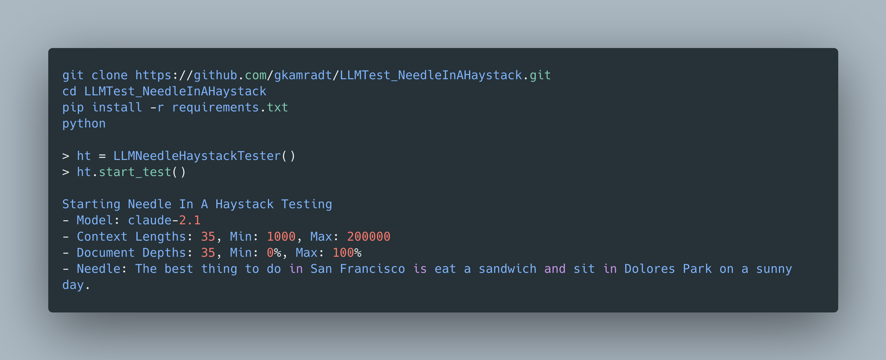

# Needle In A Haystack - Pressure Testing LLMs

Supported model providers: OpenAI, Anthropic

A simple 'needle in a haystack' analysis to test in-context retrieval ability of long context LLMs.

Get the behind the scenes on the [overview video](https://youtu.be/KwRRuiCCdmc).



## Getting Started

```zsh
$ git clone https://github.com/gkamradt/LLMTest_NeedleInAHaystack.git
$ make setup
$ source ./venv/bin/activate
$ pip install -r requirements.txt
```
You can then run the analysis on OpenAI or Anthropic models by running `main.py` with the command line arguments shown below. `LLMNeedleHaystackTester` parameters can also be passed as command line arguments, except `model_to_test` and `evaluator` of course.
* `provider` - The provider of the model, available options are `openai` and `anthropic`. Defaults to `openai`
* `evaluator` - The evaluator, which can either be a `model` or `LangSmith`. See more on `LangSmith` below. If using a `model`, only `openai` is currently supported. Defaults to `openai`.
* `api_key` - API key for either OpenAI or Anthropic provider. Can either be passed as a command line argument or an environment variable named `OPENAI_API_KEY` or `ANTHROPIC_API_KEY` depending on the provider. Defaults to `None`.
* `evaluator_api_key` - API key for OpenAI provider. Can either be passed as a command line argument or an environment variable named `OPENAI_API_KEY`. Defaults to `None`

## The Test
1. Place a random fact or statement (the 'needle') in the middle of a long context window (the 'haystack')
2. Ask the model to retrieve this statement
3. Iterate over various document depths (where the needle is placed) and context lengths to measure performance

This is the code that backed [this OpenAI](https://twitter.com/GregKamradt/status/1722386725635580292) and [Anthropic analysis](https://twitter.com/GregKamradt/status/1727018183608193393).

If ran and `save_results = True`, then this script will populate a `result/` directory with evaluation information. Due to potential concurrent requests each new test will be saved as a few file.

I've put the results from the original tests in `/original_results`. I've upgraded the script since those test were ran so the data formats may not match your script results.

`LLMNeedleHaystackTester` parameters:
* `model_to_test` - The model to run the needle in a haystack test on. Default is None.
* `evaluator` - An evaluator to evaluate the model's response. Default is None.
* `needle` - The statement or fact which will be placed in your context ('haystack')
* `haystack_dir` - The directory which contains the text files to load as background context. Only text files are supported
* `retrieval_question` - The question with which to retrieve your needle in the background context
* `results_version` - You may want to run your test multiple times for the same combination of length/depth, change the version number if so
* `num_concurrent_requests` - Default: 1. Set higher if you'd like to run more requests in parallel. Keep in mind rate limits.
* `save_results` - Whether or not you'd like to save your results to file. They will be temporarily saved in the object regardless. True/False
* `save_contexts` - Whether or not you'd like to save your contexts to file. **Warning** these will get very long. True/False
* `final_context_length_buffer` - The amount of context to take off each input to account for system messages and output tokens. This can be more intelligent but using a static value for now. Default 200 tokens.
* `context_lengths_min` - The starting point of your context lengths list to iterate
* `context_lengths_max` - The ending point of your context lengths list to iterate
* `context_lengths_num_intervals` - The number of intervals between your min/max to iterate through
* `context_lengths` - A custom set of context lengths. This will override the values set for `context_lengths_min`, max, and intervals if set
* `document_depth_percent_min` - The starting point of your document depths. Should be int > 0
* `document_depth_percent_max` - The ending point of your document depths. Should be int < 100
* `document_depth_percent_intervals` - The number of iterations to do between your min/max points
* `document_depth_percents` - A custom set of document depths lengths. This will override the values set for `document_depth_percent_min`, max, and intervals if set
* `document_depth_percent_interval_type` - Determines the distribution of depths to iterate over. 'linear' or 'sigmoid
* `seconds_to_sleep_between_completions` - Default: None, set # of seconds if you'd like to slow down your requests
* `print_ongoing_status` - Default: True, whether or not to print the status of test as they complete

`LLMMultiNeedleHaystackTester` parameters:
* `multi_needle` - True or False, whether to run multi-needle
* `needles` - List of needles to insert in the context

Other Parameters:
* `api_key` - API key for either OpenAI or Anthropic provider. Can either be passed when creating the object or an environment variable
* `model_name` - The name of the model you'd like to use. Should match the exact value which needs to be passed to the api. Ex: For OpenAI inference and evaluator models it would be `gpt-3.5-turbo-0125`.

## Results Visualization
`LLMNeedleInHaystackVisualization.ipynb` holds the code to make the pivot table visualization. The pivot table was then transferred to Google Slides for custom annotations and formatting. See the [google slides version](https://docs.google.com/presentation/d/15JEdEBjm32qBbqeYM6DK6G-3mUJd7FAJu-qEzj8IYLQ/edit?usp=sharing). See an overview of how this viz was created [here](https://twitter.com/GregKamradt/status/1729573848893579488).

## OpenAI's GPT-4-128K (Run 11/8/2023)


## Anthropic's Claude 2.1 (Run 11/21/2023)


## Multi Needle Evaluator

To enable multi-needle insertion into our context, use `--multi_needle True`.

This inserts the first needle at the specified `depth_percent`, then evenly distributes subsequent needles through the remaining context after this depth.

For even spacing, it calculates the `depth_percent_interval` as:

```
depth_percent_interval = (100 - depth_percent) / len(self.needles)
```

So, the first needle is placed at a depth percent of `depth_percent`, the second at `depth_percent + depth_percent_interval`, the third at `depth_percent + 2 * depth_percent_interval`, and so on.

Following example shows the depth percents for the case of 10 needles and depth_percent of 40%.
```
depth_percent_interval = (100 - 40) / 10 = 6

Needle 1: 40
Needle 2: 40 + 6 = 46
Needle 3: 40 + 2 * 6 = 52
Needle 4: 40 + 3 * 6 = 58
Needle 5: 40 + 4 * 6 = 64
Needle 6: 40 + 5 * 6 = 70
Needle 7: 40 + 6 * 6 = 76
Needle 8: 40 + 7 * 6 = 82
Needle 9: 40 + 8 * 6 = 88
Needle 10: 40 + 9 * 6 = 94
```

## LangSmith Evaluator

You can use LangSmith to orchestrate evals and store results.

(1) Sign up for [LangSmith](https://docs.smith.langchain.com/setup)
(2) Set env variables for LangSmith as specified in the setup.
(3) In the `Datasets + Testing` tab, use `+ Dataset` to create a new dataset, call it `multi-needle-eval-sf` to start.
(4) Populate the dataset with a test question:
```
question: What are the 5 best things to do in San Franscisco?
answer: "The 5 best things to do in San Francisco are: 1) Go to Dolores Park. 2) Eat at Tony's Pizza Napoletana. 3) Visit Alcatraz. 4) Hike up Twin Peaks. 5) Bike across the Golden Gate Bridge"
```

(5) Run with ` --evaluator langsmith` and `--eval_set multi-needle-eval-sf` to run against our recently created eval set.

Let's see all these working together on a new dataset, `multi-needle-eval-pizza`.

Here is the `multi-needle-eval-pizza` eval set, which has a question and reference answer. You can also and resulting runs:
https://smith.langchain.com/public/74d2af1c-333d-4a73-87bc-a837f8f0f65c/d

Here is the command to run this using multi-needle eval and passing the relevant needles: 
```
python main.py --evaluator langsmith --context_lengths_num_intervals 3 --document_depth_percent_intervals 3 --provider openai --model_name "gpt-4-0125-preview" --multi_needle True --eval_set multi-needle-eval-pizza --needles '["Figs are one of the three most delicious pizza toppings.", "Prosciutto is one of the three most delicious pizza toppings.", "Goat cheese is one of the three most delicious pizza toppings."]'
```
## License

This project is licensed under the MIT License - see the [LICENSE](LICENSE.txt) file for details. Use of this software requires attribution to the original author and project, as detailed in the license.
