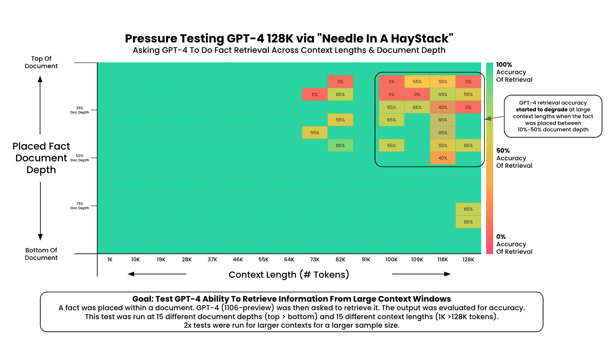

# Needle In A Haystack - Pressure Testing LLMs

Supported model providers: OpenAI, Anthropic

A simple 'needle in a haystack' analysis to test in-context retrieval ability of long context LLMs.

Get the behind the scenes on the [overview video](https://youtu.be/KwRRuiCCdmc).


```
$ git clone https://github.com/prabha-git/LLMTest_NeedleInAHaystack.git
$ cd LLMTest_NeedleInAHaystack
$ python -m venv venv
$ pip install -r requirements.txt 
$ export OPENAI_API_KEY=<<openai_key>>
$ Python

>>> from OpenAIEvaluator import OpenAIEvaluator
>>> openai_ht = OpenAIEvaluator(model_name='gpt-4-1106-preview', evaluation_method='gpt4')
>>> openai_ht.start_test()

Starting Needle In A Haystack Testing...
- Model: gpt-4-1106-preview
- Context Lengths: 35, Min: 1000, Max: 200000 
- Document Depths: 35, Min: 0%, Max: 100%
- Needle: The best thing to do in San Francisco is eat a sandwich and sit in Dolores Park on a sunny day.
```

## The Test
1. Place a random fact or statement (the 'needle') in the middle of a long context window (the 'haystack')
2. Ask the model to retrieve this statement
3. Iterate over various document depths (where the needle is placed) and context lengths to measure performance

This is the code that backed [this OpenAI](https://twitter.com/GregKamradt/status/1722386725635580292) and [Anthropic analysis](https://twitter.com/GregKamradt/status/1727018183608193393).

If ran and `save_results = True`, then this script will populate a `result/` directory with evaluation information. Due to potential concurrent requests each new test will be saved as a few file.

I've put the results from the original tests in `/original_results`. I've upgraded the script since those test were ran so the data formats may not match your script results.

The key parameters:
* `needle` - The statement or fact which will be placed in your context ('haystack')
* `haystack_dir` - The directory which contains the text files to load as background context. Only text files are supported
* `retrieval_question` - The question with which to retrieve your needle in the background context
* `results_version` - You may want to run your test multiple times for the same combination of length/depth, change the version number if so
* `context_lengths_min` - The starting point of your context lengths list to iterate
* `context_lengths_max` - The ending point of your context lengths list to iterate
* `context_lengths_num_intervals` - The number of intervals between your min/max to iterate through
* `document_depth_percent_min` - The starting point of your document depths. Should be int > 0
* `document_depth_percent_max` - The ending point of your document depths. Should be int < 100
* `document_depth_percent_intervals` - The number of iterations to do between your min/max points
* `document_depth_percent_interval_type` - Determines the distribution of depths to iterate over. 'linear' or 'sigmoid
* `model_name` - The name of the model you'd like to test. Should match the exact value which needs to be passed to the api. Ex: `gpt-4-1106-preview`
* `save_results` - Whether or not you'd like to save your results to file. They will be temporarily saved in the object regardless. True/False
* `save_contexts` - Whether or not you'd like to save your contexts to file. **Warning** these will get very long. True/False

Other Parameters:
* `context_lengths` - A custom set of context lengths. This will override the values set for `context_lengths_min`, max, and intervals if set
* `document_depth_percents` - A custom set of document depths lengths. This will override the values set for `document_depth_percent_min`, max, and intervals if set
* `openai_api_key` - Must be supplied. GPT-4 is used for evaluation. Can either be passed when creating the object or an environment variable
* `anthropic_api_key` - Only needed if testing Anthropic models. Can either be passed when creating the object or an environment variable
* `num_concurrent_requests` - Default: 1. Set higher if you'd like to run more requests in parallel. Keep in mind rate limits.
* `final_context_length_buffer` - The amount of context to take off each input to account for system messages and output tokens. This can be more intelligent but using a static value for now. Default 200 tokens.
* `seconds_to_sleep_between_completions` - Default: None, set # of seconds if you'd like to slow down your requests
* `print_ongoing_status` - Default: True, whether or not to print the status of test as they complete
* `evaluation_method` - Default: gpt4 Choose between gpt4 and simple substring matching (substring_match) to evaluate
* `substr_validation_words` - Default: ['dolores', 'sandwich'] If you choose substring evaluation of LLM response, presence of these list of keywords are verified to determine if the LLM respone is correct or not


#### Note on Evaluation Method (`evaluation_method`):

There are two options for evaluation: `gpt4` and `substring_method`.

- `gpt4`: This is the default, utilizing the GPT-4 model to assess responses with a scoring range from 1 to 10. This method is particularly effective when dealing with a broad topic (Large Needle), where using a few hardcoded keywords to evaluate the accuracy and relevance of the response may not be sufficient.
```
    - Score 1: The response is completely unrelated to the reference.
    - Score 3: The response has some relevance but does not fully align with the reference.
    - Score 5: The response is moderately relevant but includes inaccuracies.
    - Score 7: The response aligns well with the reference but has minor omissions.
    - Score 10: The response is entirely accurate and aligns perfectly with the reference.
```
- `substring_method`: This approach is suitable for "small needles", where a predefined list of keywords can effectively determine if the response retrieves the essential information. It provides a binary score of either 0 or 1. Opting for this method can also reduce GPT-4 API evaluation costs.

## Results Visualization
`LLMNeedleInHaystackVisualization.ipynb` holds the code to make the pivot table visualization. The pivot table was then transferred to Google Slides for custom annotations and formatting. See the [google slides version](https://docs.google.com/presentation/d/15JEdEBjm32qBbqeYM6DK6G-3mUJd7FAJu-qEzj8IYLQ/edit?usp=sharing). See an overview of how this viz was created [here](https://twitter.com/GregKamradt/status/1729573848893579488).

## OpenAI's GPT-4-128K (Run 11/8/2023)


## Anthropic's Claude 2.1 (Run 11/21/2023)


## License

This project is licensed under the MIT License - see the [LICENSE](LICENSE.txt) file for details. Use of this software requires attribution to the original author and project, as detailed in the license.